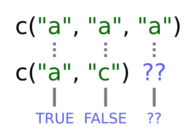
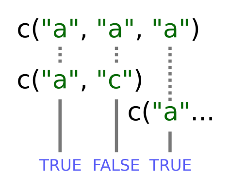

In this lesson, we'll learn about working with data frames using the gapminder 
dataset in your R project folder:

~~~
gapminder <- read.csv("data/gapminder-FiveYearData.csv")
~~~
{: .r}

Let's investigate gapminder a bit; the first thing we should always do is check
out what the data looks like with `str`:

~~~
str(gapminder)
~~~
{: .r}

~~~
'data.frame':	1704 obs. of  6 variables:
 $ country  : Factor w/ 142 levels "Afghanistan",..: 1 1 1 1 1 1 1 1 1 1 ...
 $ year     : int  1952 1957 1962 1967 1972 1977 1982 1987 1992 1997 ...
 $ pop      : num  8425333 9240934 10267083 11537966 13079460 ...
 $ continent: Factor w/ 5 levels "Africa","Americas",..: 3 3 3 3 3 3 3 3 3 3 ...
 $ lifeExp  : num  28.8 30.3 32 34 36.1 ...
 $ gdpPercap: num  779 821 853 836 740 ...
~~~
{: .output}

We can also examine individual columns of the data frame with our `typeof` function:

~~~
typeof(gapminder$year)
~~~
{: .r}

~~~
[1] "integer"
~~~
{: .output}

~~~
typeof(gapminder$country)
~~~
{: .r}

~~~
[1] "integer"
~~~
{: .output}

~~~
str(gapminder$country)
~~~
{: .r}

~~~
 Factor w/ 142 levels "Afghanistan",..: 1 1 1 1 1 1 1 1 1 1 ...
~~~
{: .output}

We can also interrogate the data frame for information about its dimensions;
remembering that `str(gapminder)` said there were 1704 observations of 6
variables in gapminder, what do you think the following will produce, and why?

~~~
length(gapminder)
~~~
{: .r}

~~~
[1] 6
~~~
{: .output}

A fair guess would have been to say that the length of a data frame would be the
number of rows it has (1704), but this is not the case; remember, a data frame
is a *list of vectors and factors*:

~~~
typeof(gapminder)
~~~
{: .r}

~~~
[1] "list"
~~~
{: .output}

When `length` gave us 6, it's because gapminder is built out of a list of 6
columns. To get the number of rows and columns in our dataset, try:

~~~
nrow(gapminder)
~~~
{: .r}

~~~
[1] 1704
~~~
{: .output}

~~~
ncol(gapminder)
~~~
{: .r}

~~~
[1] 6
~~~
{: .output}

Or, both at once:

~~~
dim(gapminder)
~~~
{: .r}

~~~
[1] 1704    6
~~~
{: .output}

We'll also likely want to know what the titles of all the columns are, so we can
ask for them later:

~~~
colnames(gapminder)
~~~
{: .r}

~~~
[1] "country"   "year"      "pop"       "continent" "lifeExp"   "gdpPercap"
~~~
{: .output}

At this stage, it's important to ask ourselves if the structure R is reporting
matches our intuition or expectations; do the basic data types reported for each
column make sense? If not, we need to sort any problems out now before they turn
into bad surprises down the road, using what we've learned about how R
interprets data, and the importance of *strict consistency* in how we record our
data.

Once we're happy that the data types and structures seem reasonable, it's time
to start digging into our data proper. Check out the first few lines:

~~~
head(gapminder)
~~~
{: .r}

~~~
      country year      pop continent lifeExp gdpPercap
1 Afghanistan 1952  8425333      Asia  28.801  779.4453
2 Afghanistan 1957  9240934      Asia  30.332  820.8530
3 Afghanistan 1962 10267083      Asia  31.997  853.1007
4 Afghanistan 1967 11537966      Asia  34.020  836.1971
5 Afghanistan 1972 13079460      Asia  36.088  739.9811
6 Afghanistan 1977 14880372      Asia  38.438  786.1134
~~~
{: .output}

To make sure our analysis is reproducible, we should put the code
into a script file so we can come back to it later.

> ## Challenge
>
> Read the output of `str(gapminder)` again;
> this time, use what you've learned about factors, lists and vectors,
> as well as the output of functions like `colnames` and `dim`
> to explain what everything that `str` prints out for gapminder means.
> If there are any parts you can't interpret, discuss with your neighbors!
>
> > ## Solution to Challenge
> >
> > The object `gapminder` is a data frame with columns
> > - `country` and `continent` are factors.
> > - `year` is an integer vector.
> > - `pop`, `lifeExp`, and `gdpPercap` are numeric vectors.
> >
> {: .solution}
{: .challenge}

R has many powerful subset operators and mastering them will allow you to
easily perform complex operations on any kind of dataset.

There are six different ways we can subset any kind of object, and three
different subsetting operators for the different data structures.

## Accessing elements using their indices

~~~
x[3]
~~~
{: .r}

~~~
[1] NA
~~~
{: .output}
We can ask for multiple elements at once:

~~~
x[c(1, 3)]
~~~
{: .r}

~~~
[1] "_episodes_rmd/02-data-frames.Rmd" NA                                
~~~
{: .output}

Or slices of the vector:

~~~
x[1:4]
~~~
{: .r}

~~~
[1] "_episodes_rmd/02-data-frames.Rmd" NA                                
[3] NA                                 NA                                
~~~
{: .output}

the `:` operator creates a sequence of numbers from the left element to the right.

~~~
1:4
~~~
{: .r}

~~~
[1] 1 2 3 4
~~~
{: .output}

~~~
c(1, 2, 3, 4)
~~~
{: .r}

~~~
[1] 1 2 3 4
~~~
{: .output}

If we ask for a number outside of the vector, R will return missing values:

~~~
x[6]
~~~
{: .r}

~~~
[1] NA
~~~
{: .output}

## Skipping and removing elements

If we use a negative number as the index of a vector, R will return
every element *except* for the one specified:

~~~
x[-2]
~~~
{: .r}

~~~
[1] "_episodes_rmd/02-data-frames.Rmd"
~~~
{: .output}

We can skip multiple elements:

~~~
x[c(-1, -5)]  # or x[-c(1,5)]
~~~
{: .r}

~~~
character(0)
~~~
{: .output}

> ## Tip: Order of operations
>
> A common trip up for novices occurs when trying to skip
> slices of a vector. Most people first try to negate a
> sequence like so:
>
> 
> ~~~
> x[-1:3]
> ~~~
> {: .r}
>
> This gives a somewhat cryptic error:
>
> 
> ~~~
> Error in x[-1:3]: only 0's may be mixed with negative subscripts
> ~~~
> {: .error}
>
> But remember the order of operations. `:` is really a function, so
> what happens is it takes its first argument as -1, and second as 3,
> so generates the sequence of numbers: `c(-1, 0, 1, 2, 3)`.
>
> The correct solution is to wrap that function call in brackets, so
> that the `-` operator applies to the results:
>
> 
> ~~~
> x[-(1:3)]
> ~~~
> {: .r}
> 
> 
> 
> ~~~
> character(0)
> ~~~
> {: .output}
{: .callout}

To remove elements from a vector, we need to assign the results back
into the variable:

~~~
x <- x[-4]
x
~~~
{: .r}

~~~
[1] "_episodes_rmd/02-data-frames.Rmd"
~~~
{: .output}

## Subsetting by name

We can extract elements by using their name, instead of index:

~~~
x[c("a", "c")]
~~~
{: .r}

~~~
[1] NA NA
~~~
{: .output}

This is usually a much more reliable way to subset objects: the
position of various elements can often change when chaining together
subsetting operations, but the names will always remain the same!

Unfortunately we can't skip or remove elements so easily.

To skip (or remove) a single named element:

~~~
x[-which(names(x) == "a")]
~~~
{: .r}

~~~
character(0)
~~~
{: .output}

The `which` function returns the indices of all `TRUE` elements of its argument.
Remember that expressions evaluate before being passed to functions. Let's break
this down so that its clearer what's happening.

First this happens:

~~~
names(x) == "a"
~~~
{: .r}

~~~
logical(0)
~~~
{: .output}

The condition operator is applied to every name of the vector `x`. Only the
first name is "a" so that element is TRUE.

`which` then converts this to an index:

~~~
which(names(x) == "a")
~~~
{: .r}

~~~
integer(0)
~~~
{: .output}

Only the first element is `TRUE`, so `which` returns 1. Now that we have indices
the skipping works because we have a negative index!

Skipping multiple named indices is similar, but uses a different comparison
operator:

~~~
x[-which(names(x) %in% c("a", "c"))]
~~~
{: .r}

~~~
character(0)
~~~
{: .output}

The `%in%` goes through each element of its left argument, in this case the
names of `x`, and asks, "Does this element occur in the second argument?".

> ## Challenge 2
>
> Run the following code to define vector `x` as above:
>
> 
> ~~~
> x <- c(5.4, 6.2, 7.1, 4.8, 7.5)
> names(x) <- c('a', 'b', 'c', 'd', 'e')
> print(x)
> ~~~
> {: .r}
> 
> 
> 
> ~~~
>   a   b   c   d   e 
> 5.4 6.2 7.1 4.8 7.5 
> ~~~
> {: .output}
>
> Given this vector `x`, what would you expect the following to do?
>
>~~~
> x[-which(names(x) == "g")]
>~~~
>{: .r}
>
> Try out this command and see what you get. Did this match your expectation?
> Why did we get this result? (Tip: test out each part of the command on it's own - this is a useful debugging strategy)
>
> Which of the following are true:
>
> * A) if there are no `TRUE` values passed to `which`, an empty vector is returned
> * B) if there are no `TRUE` values passed to `which`, an error message is shown
> * C) `integer()` is an empty vector
> * D) making an empty vector negative produces an "everything" vector
> * E) `x[]` gives the same result as `x[integer()]`
>
> > ## Solution to challenge 2
> >
> > A and C are correct.
> >
> > The `which` command returns the index of every `TRUE` value in its
> > input. The `names(x) == "g"` command didn't return any `TRUE` values. Because
> > there were no `TRUE` values passed to the `which` command, it returned an
> > empty vector. Negating this vector with the minus sign didn't change its
> > meaning. Because we used this empty vector to retrieve values from `x`, it
> > produced an empty numeric vector. It was a `named numeric` empty vector
> > because the vector type of x is "named numeric" since we assigned names to the
> > values (try `str(x)` ).
> {: .solution}
{: .challenge}

> ## Tip: Getting help for operators
>
> Remember you can search for help on operators by wrapping them in quotes:
> `help("%in%")` or `?"%in%"`.
>
{: .callout}

So why can't we use `==` like before? That's an excellent question.

Let's take a look at the comparison component of this code:

~~~
names(x) == c('a', 'c')
~~~
{: .r}

~~~
Warning in names(x) == c("a", "c"): longer object length is not a multiple
of shorter object length
~~~
{: .error}

~~~
[1]  TRUE FALSE FALSE FALSE FALSE
~~~
{: .output}

Obviously "c" is in the names of `x`, so why didn't this work? `==`
works slightly differently than `%in%`. It will compare each element
of its left argument to the corresponding element of its right
argument. What happens when you compare vectors of different lengths?

When one vector is shorter than the other, it gets *recycled*:

In this case R simply repeats `c("a", "c")` twice. Since the recycled "a"
matches x again we got the output: TRUE FALSE TRUE

If the longer vector length isn't a multiple of the shorter vector 
length, then R will also print out a warning message.

~~~
names(x) == c('a', 'c', 'e')
~~~
{: .r}

~~~
Warning in names(x) == c("a", "c", "e"): longer object length is not a
multiple of shorter object length
~~~
{: .error}

~~~
[1]  TRUE FALSE FALSE FALSE FALSE
~~~
{: .output}

This difference between `==` and `%in%` is important to remember,
because it can introduce hard to find and subtle bugs!

## Subsetting through other logical operations

We can also more simply subset through logical operations:

~~~
x[c(TRUE, TRUE, FALSE, FALSE)]
~~~
{: .r}

~~~
  a   b   e 
5.4 6.2 7.5 
~~~
{: .output}

Note that in this case, the logical vector is also recycled to the
length of the vector we're subsetting!

~~~
x[c(TRUE, FALSE)]
~~~
{: .r}

~~~
  a   c   e 
5.4 7.1 7.5 
~~~
{: .output}

Since comparison operators evaluate to logical vectors, we can also
use them to succinctly subset vectors:

~~~
x[x > 7]
~~~
{: .r}

~~~
  c   e 
7.1 7.5 
~~~
{: .output}

> ## Tip: Combining logical conditions
>
> There are many situations in which you will wish to combine multiple logical
> criteria. For example, we might want to find all the countries that are
> located in Asia **or** Europe **and** have life expectancies within a certain
> range. Several operations for combining logical vectors exist in R:
>
>  * `&`, the "logical AND" operator: returns `TRUE` if both the left and right
>    are `TRUE`.
>  * `|`, the "logical OR" operator: returns `TRUE`, if either the left or right
>    (or both) are `TRUE`.
>
> The recycling rule applies with both of these, so `TRUE & c(TRUE, FALSE, TRUE)`
> will compare the first `TRUE` on the left of the `&` sign with each of the
> three conditions on the right.
>
> You may sometimes see `&&` and `||` instead of `&` and `|`. These operators
> do not use the recycling rule: they only look at the first element of each
> vector and ignore the remaining elements. The longer operators are mainly used
> in programming, rather than data analysis.
>
>  * `!`, the "logical NOT" operator: converts `TRUE` to `FALSE` and `FALSE` to
>    `TRUE`. It can negate a single logical condition (eg `!TRUE` becomes
>    `FALSE`), or a whole vector of conditions(eg `!c(TRUE, FALSE)` becomes
>    `c(FALSE, TRUE)`).
>
> Additionally, you can compare the elements within a single vector using the
> `all` function (which returns `TRUE` if every element of the vector is `TRUE`)
> and the `any` function (which returns `TRUE` if one or more elements of the
> vector are `TRUE`).
{: .callout}

> ## Challenge 3
>
> Given the following code:
>
> 
> ~~~
> x <- c(5.4, 6.2, 7.1, 4.8, 7.5)
> names(x) <- c('a', 'b', 'c', 'd', 'e')
> print(x)
> ~~~
> {: .r}
> 
> 
> 
> ~~~
>   a   b   c   d   e 
> 5.4 6.2 7.1 4.8 7.5 
> ~~~
> {: .output}
>
> Write a subsetting command to return the values in x that are greater than 4 and less than 7.
>
> > ## Solution to challenge 3
> >
> > 
> > ~~~
> > x_subset <- x[x<7 & x>4]
> > print(x_subset)
> > ~~~
> > {: .r}
> > 
> > 
> > 
> > ~~~
> >   a   b   d 
> > 5.4 6.2 4.8 
> > ~~~
> > {: .output}
> {: .solution}
{: .challenge}

## Handling special values

At some point you will encounter functions in R which cannot handle missing, infinite,
or undefined data.

There are a number of special functions you can use to filter out this data:

 * `is.na` will return all positions in a vector, matrix, or data.frame
   containing `NA`.
 * likewise, `is.nan`, and `is.infinite` will do the same for `NaN` and `Inf`.
 * `is.finite` will return all positions in a vector, matrix, or data.frame
   that do not contain `NA`, `NaN` or `Inf`.
 * `na.omit` will filter out all missing values from a vector

## Factor subsetting

Now that we've explored the different ways to subset vectors, how
do we subset the other data structures?

Factor subsetting works the same way as vector subsetting.

~~~
f <- factor(c("a", "a", "b", "c", "c", "d"))
f[f == "a"]
~~~
{: .r}

~~~
[1] a a
Levels: a b c d
~~~
{: .output}

~~~
f[f %in% c("b", "c")]
~~~
{: .r}

~~~
[1] b c c
Levels: a b c d
~~~
{: .output}

~~~
f[1:3]
~~~
{: .r}

~~~
[1] a a b
Levels: a b c d
~~~
{: .output}

An important note is that skipping elements will not remove the level
even if no more of that category exists in the factor:

~~~
f[-3]
~~~
{: .r}

~~~
[1] a a c c d
Levels: a b c d
~~~
{: .output}

## Data frames

Remember the data frames are lists underneath the hood, so similar rules
apply. However they are also two dimensional objects:

`[` with one argument will act the same was as for lists, where each list
element corresponds to a column. The resulting object will be a data frame:

~~~
head(gapminder[3])
~~~
{: .r}

~~~
       pop
1  8425333
2  9240934
3 10267083
4 11537966
5 13079460
6 14880372
~~~
{: .output}

Similarly, `[[` will act to extract *a single column*:

~~~
head(gapminder[["lifeExp"]])
~~~
{: .r}

~~~
[1] 28.801 30.332 31.997 34.020 36.088 38.438
~~~
{: .output}

And `$` provides a convenient shorthand to extract columns by name:

~~~
head(gapminder$year)
~~~
{: .r}

~~~
[1] 1952 1957 1962 1967 1972 1977
~~~
{: .output}

With two arguments, `[` behaves the same way as for matrices:

~~~
gapminder[1:3,]
~~~
{: .r}

~~~
      country year      pop continent lifeExp gdpPercap
1 Afghanistan 1952  8425333      Asia  28.801  779.4453
2 Afghanistan 1957  9240934      Asia  30.332  820.8530
3 Afghanistan 1962 10267083      Asia  31.997  853.1007
~~~
{: .output}

If we subset a single row, the result will be a data frame (because
the elements are mixed types):

~~~
gapminder[3,]
~~~
{: .r}

~~~
      country year      pop continent lifeExp gdpPercap
3 Afghanistan 1962 10267083      Asia  31.997  853.1007
~~~
{: .output}

But for a single column the result will be a vector (this can
be changed with the third argument, `drop = FALSE`).

> ## Challenge 7
>
> Fix each of the following common data frame subsetting errors:
>
> 1. Extract observations collected for the year 1957
>
>    
>    ~~~
>    gapminder[gapminder$year = 1957,]
>    ~~~
>    {: .r}
>
> 2. Extract all columns except 1 through to 4
>
>    
>    ~~~
>    gapminder[,-1:4]
>    ~~~
>    {: .r}
>
> 3. Extract the rows where the life expectancy is longer the 80 years
>
>    
>    ~~~
>    gapminder[gapminder$lifeExp > 80]
>    ~~~
>    {: .r}
>
> 4. Extract the first row, and the fourth and fifth columns
>   (`lifeExp` and `gdpPercap`).
>
>    
>    ~~~
>    gapminder[1, 4, 5]
>    ~~~
>    {: .r}
>
> 5. Advanced: extract rows that contain information for the years 2002
>    and 2007
>
>    
>    ~~~
>    gapminder[gapminder$year == 2002 | 2007,]
>    ~~~
>    {: .r}
>
> > ## Solution to challenge 7
> >
> > Fix each of the following common data frame subsetting errors:
> >
> > 1. Extract observations collected for the year 1957
> >
> >    
> >    ~~~
> >    # gapminder[gapminder$year = 1957,]
> >    gapminder[gapminder$year == 1957,]
> >    ~~~
> >    {: .r}
> >
> > 2. Extract all columns except 1 through to 4
> >
> >    
> >    ~~~
> >    # gapminder[,-1:4]
> >    gapminder[,-c(1:4)]
> >    ~~~
> >    {: .r}
> >
> > 3. Extract the rows where the life expectancy is longer the 80 years
> >
> >    
> >    ~~~
> >    # gapminder[gapminder$lifeExp > 80]
> >    gapminder[gapminder$lifeExp > 80,]
> >    ~~~
> >    {: .r}
> >
> > 4. Extract the first row, and the fourth and fifth columns
> >   (`lifeExp` and `gdpPercap`).
> >
> >    
> >    ~~~
> >    # gapminder[1, 4, 5]
> >    gapminder[1, c(4, 5)]
> >    ~~~
> >    {: .r}
> >
> > 5. Advanced: extract rows that contain information for the years 2002
> >    and 2007
> >
> >     
> >     ~~~
> >     # gapminder[gapminder$year == 2002 | 2007,]
> >     gapminder[gapminder$year == 2002 | gapminder$year == 2007,]
> >     gapminder[gapminder$year %in% c(2002, 2007),]
> >     ~~~
> >     {: .r}
> {: .solution}
{: .challenge}

> ## Challenge 8
>
> 1. Why does `gapminder[1:20]` return an error? How does it differ from `gapminder[1:20, ]`?
>
>
> 2. Create a new `data.frame` called `gapminder_small` that only contains rows 1 through 9
> and 19 through 23. You can do this in one or two steps.
>
> > ## Solution to challenge 8
> >
> > 1.  `gapminder` is a data.frame so needs to be subsetted on two dimensions. `gapminder[1:20, ]` subsets the data to give the first 20 rows and all columns.
> >
> > 2. 
> >
> > 
> > ~~~
> > gapminder_small <- gapminder[c(1:9, 19:23),]
> > ~~~
> > {: .r}
> {: .solution}
{: .challenge}
